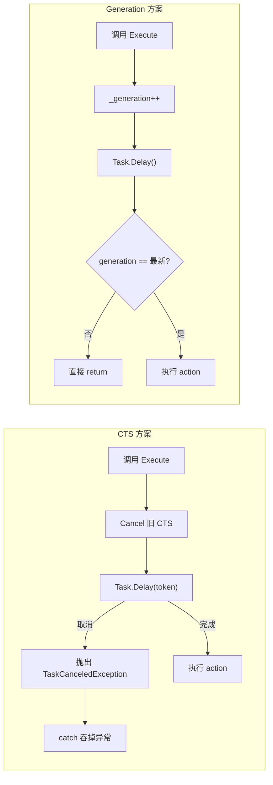

# 功能特性

## 功能概览

| 功能 | 说明 |
|------|------|
| 全局热键 | 系统级快捷键，即使应用未聚焦也能触发 |
| 软件内热键 | 仅在应用聚焦时生效的快捷键 |
| 按住触发键 | 按住特定键时临时激活功能 |
| 剪贴板监听 | 监听剪贴板变化并自动翻译 |
| 图片翻译 OCR 专用服务 | 为图片翻译单独指定 OCR 引擎，和全局 OCR 配置解耦 |
| 历史记录 | SQLite 存储翻译历史，支持搜索、导出、收藏 |
| 插件市场 | 内置插件市场，支持搜索、下载、升级插件 |

## 图片翻译 OCR 专用服务

图片翻译场景支持独立的 OCR 服务绑定，不再与“全局 OCR 启用项”强耦合。

### 配置入口

- 进入 `设置 -> 服务 -> 文本识别`
- 顶部新增“图片翻译 OCR 服务”卡片
- 可通过以下方式设置：
  - 将左侧 OCR 服务拖拽到卡片区域
  - 在服务卡片右键选择“设为图片翻译OCR服务”
  - 在图片翻译窗口底部 OCR 下拉框直接切换

### 运行规则

图片翻译执行 OCR 时按以下优先级取用服务：

1. 优先使用 `ImageTranslateOcrService`
2. 若未配置专用服务，回退到当前“全局启用”的 OCR 服务
3. 若两者都不可用，提示用户并跳转到“设置 -> 服务 -> 文本识别”

### 行为说明

- 图片翻译窗口下拉框绑定的是 `ImageTranslateOcrService`，切换后会持久化保存
- 在图片翻译窗口切换 OCR 不会修改服务列表中的 `IsEnabled`（不影响全局 OCR 选择）
- 普通 OCR、静默 OCR、二维码识别仍沿用全局 OCR 启用逻辑

### 相关实现文件

| 文件 | 用途 |
|------|------|
| `STranslate/Core/ServiceSettings.cs` | 新增 `ImageTranslateOcrSvcID` 持久化字段 |
| `STranslate/Services/OcrService.cs` | 专用 OCR 服务绑定、回退选择与删除联动 |
| `STranslate/ViewModels/ImageTranslateWindowViewModel.cs` | 图片翻译窗口 OCR 下拉与专用服务双向同步 |
| `STranslate/ViewModels/MainWindowViewModel.cs` | 图片翻译入口统一采用“专用优先、全局回退”逻辑 |
| `STranslate/Views/Pages/OcrPage.xaml` | OCR 设置页新增“图片翻译 OCR 服务”卡片与拖拽目标 |

## 热键系统

热键系统支持**全局热键**（系统级，即使应用未聚焦也能触发）和**软件内热键**（仅在应用聚焦时生效）。

### 热键类型

| 类型 | 说明 | 使用场景 |
|------|------|----------|
| `GlobalHotkey` | 全局热键，通过 NHotkey.Wpf 注册 | 打开窗口、截图翻译、划词翻译等 |
| `Hotkey` | 软件内热键，通过 WPF KeyBinding | 窗口内快捷键如 Ctrl+B 自动翻译 |
| 按住触发键 | 通过低级别键盘钩子实现 | 按住特定键时临时激活功能 |

### 热键数据结构 (`Core/HotkeyModel.cs`)

```csharp
public record struct HotkeyModel
{
    public bool Alt { get; set; }
    public bool Shift { get; set; }
    public bool Win { get; set; }
    public bool Ctrl { get; set; }
    public Key CharKey { get; set; } = Key.None;

    // 转换为 ModifierKeys 用于 NHotkey 注册
    public readonly ModifierKeys ModifierKeys { get; }

    // 从字符串解析（如 "Ctrl + Alt + T"）
    public HotkeyModel(string hotkeyString)

    // 验证热键有效性
    public bool Validate(bool validateKeyGestrue = false)
}
```

### 热键设置 (`Core/HotkeySettings.cs`)

```csharp
public partial class HotkeySettings : ObservableObject
{
    // 全局热键
    public GlobalHotkey OpenWindowHotkey { get; set; } = new("Alt + G");
    public GlobalHotkey InputTranslateHotkey { get; set; } = new("None");
    public GlobalHotkey CrosswordTranslateHotkey { get; set; } = new("Alt + D");
    public GlobalHotkey ScreenshotTranslateHotkey { get; set; } = new("Alt + S");
    public GlobalHotkey ClipboardMonitorHotkey { get; set; } = new("Alt + Shift + A");  // 剪贴板监听开关
    public GlobalHotkey OcrHotkey { get; set; } = new("Alt + Shift + S");
    // ... 其他全局热键

    // 软件内热键 - MainWindow
    public Hotkey OpenSettingsHotkey { get; set; } = new("Ctrl + OemComma");
    public Hotkey AutoTranslateHotkey { get; set; } = new("Ctrl + B");
    // ... 其他软件内热键
}
```

### 全局热键注册 (`Helpers/HotkeyMapper.cs`)

全局热键注册使用两种机制：

#### 1. NHotkey.Wpf（标准热键）

```csharp
internal static bool SetHotkey(HotkeyModel hotkey, Action action)
{
    HotkeyManager.Current.AddOrReplace(
        hotkeyStr,
        hotkey.CharKey,
        hotkey.ModifierKeys,
        (_, _) => action.Invoke()
    );
}
```

#### 2. ChefKeys（Win 键专用）

```csharp
// LWin/RWin 需要使用 ChefKeys 库
if (hotkeyStr is "LWin" or "RWin")
    return SetWithChefKeys(hotkeyStr, action);
```

#### 3. 低级别键盘钩子（按住触发）

```csharp
// 使用 SetWindowsHookEx(WH_KEYBOARD_LL) 实现全局按键监听
public static void StartGlobalKeyboardMonitoring()
{
    _hookProc = HookCallback;
    _hookHandle = PInvoke.SetWindowsHookEx(
        WINDOWS_HOOK_ID.WH_KEYBOARD_LL,
        _hookProc,
        hModule,
        0
    );
}
```

### 热键注册流程

```
App.OnStartup()
→ _hotkeySettings.LazyInitialize()
   → ApplyCtrlCc()              // 启用/禁用 Ctrl+CC 划词
   → ApplyIncrementalTranslate() // 启用/禁用增量翻译按键
   → RegisterHotkeys()          // 注册所有全局热键
      → HotkeyMapper.SetHotkey() // 每个热键调用 NHotkey
```

### 全屏检测与热键屏蔽

```csharp
private Action WithFullscreenCheck(Action action)
{
    return () =>
    {
        if (settings.IgnoreHotkeysOnFullscreen &&
            Win32Helper.IsForegroundWindowFullscreen())
            return;  // 全屏时忽略热键

        action();
    };
}
```

### 托盘图标状态

热键状态通过托盘图标反映（优先级从高到低）：

| 状态 | 图标 | 说明 |
|------|------|------|
| `NoHotkey` | 禁用热键图标 | 全局热键被禁用 (`DisableGlobalHotkeys=true`) |
| `IgnoreOnFullScreen` | 全屏忽略图标 | 全屏时忽略热键 (`IgnoreHotkeysOnFullscreen=true`) |
| `Normal` | 正常图标 | 热键正常工作 |
| `Dev` | 开发版图标 | Debug 模式下的正常状态 |

### 热键冲突处理

```csharp
// 注册前检查热键是否可用
internal static bool CheckAvailability(HotkeyModel currentHotkey)
{
    try
    {
        HotkeyManager.Current.AddOrReplace("Test", key, modifiers, ...);
        return true;  // 可以注册
    }
    catch
    {
        return false; // 热键被占用
    }
}

// 冲突时标记并提示用户
GlobalHotkey.IsConflict = !HotkeyMapper.SetHotkey(...);
```

### 特殊热键功能

#### 1. Ctrl+CC 划词翻译

- 监听 Ctrl 键状态，检测快速按两次 C 键
- 通过 `CtrlSameCHelper` 实现（使用 `MouseKeyHook` 库）
- 支持 `DisableGlobalHotkeys` 和 `IgnoreHotkeysOnFullscreen` 设置

#### 2. 按住触发键

- 注册按住键：按下时触发 `OnPress`，抬起时触发 `OnRelease`
- 用于增量翻译等功能
- 支持 `DisableGlobalHotkeys` 和 `IgnoreHotkeysOnFullscreen` 设置

#### 3. 热键编辑控件 (`Controls/HotkeyControl.cs`)

- 自定义 WPF 控件用于热键设置界面
- 弹出对话框捕获按键输入
- 支持验证和冲突检测

### 相关文件

| 文件 | 用途 |
|------|---------|
| `STranslate/Core/HotkeySettings.cs` | 热键配置模型、热键注册管理 |
| `STranslate/Core/HotkeyModel.cs` | 热键数据结构、解析与验证 |
| `STranslate/Helpers/HotkeyMapper.cs` | 热键注册、低级别键盘钩子 |
| `STranslate/Controls/HotkeyControl.cs` | 热键设置自定义控件 |
| `STranslate/Controls/HotkeyDisplay.cs` | 热键显示自定义控件 |
| `STranslate/Views/Pages/HotkeyPage.xaml` | 热键设置页面 |

### 扩展热键

如需添加新的热键：

1. 在 `HotkeySettings.cs` 添加热键属性
2. 在热键注册逻辑中添加新热键的注册
3. 如需 UI 设置，更新 `HotkeyPage.xaml`
4. 如需特殊处理逻辑，在 `HotkeyMapper.cs` 或相关帮助类中实现

## 剪贴板监听功能

剪贴板监听功能允许应用程序在后台监视系统剪贴板的变化，当检测到文本内容时自动触发翻译。

### 实现架构

#### 核心组件 (`Helpers/ClipboardMonitor.cs`)

- 使用 Win32 API `AddClipboardFormatListener` / `RemoveClipboardFormatListener` 注册剪贴板监听
- 通过 `HwndSource` 在 WPF 窗口上挂接 `WndProc` 接收 `WM_CLIPBOARDUPDATE` 消息
- 使用 CsWin32 PInvoke 生成类型安全的 Win32 API 绑定

```csharp
public class ClipboardMonitor : IDisposable
{
    private HwndSource? _hwndSource;
    private HWND _hwnd;
    private string _lastText = string.Empty;

    public event Action<string>? OnClipboardTextChanged;

    public void Start()
    {
        // 使用 WindowInteropHelper 获取窗口句柄
        var windowHelper = new WindowInteropHelper(_window);
        _hwnd = new HWND(windowHelper.Handle);
        _hwndSource = HwndSource.FromHwnd(windowHelper.Handle);
        _hwndSource?.AddHook(WndProc);
        PInvoke.AddClipboardFormatListener(_hwnd);
    }

    private nint WndProc(nint hwnd, int msg, nint wParam, nint lParam, ref bool handled)
    {
        if (msg == PInvoke.WM_CLIPBOARDUPDATE)
        {
            _ = Task.Run(async () =>
            {
                await Task.Delay(100);  // 延迟确保剪贴板数据已完全写入
                var text = ClipboardHelper.GetText();
                if (!string.IsNullOrWhiteSpace(text) && text != _lastText)
                {
                    _lastText = text;
                    OnClipboardTextChanged?.Invoke(text);
                    _lastText = string.Empty;  // 触发后重置，允许相同内容再次触发
                }
            });
            handled = true;
        }
        return nint.Zero;
    }
}
```

### 控制方式

1. **全局热键**: `Alt + Shift + A`（默认）- 在任何地方切换监听状态
2. **主窗口按钮**: HeaderControl 中的切换按钮，带状态指示（IsOn/IsOff）
3. **设置项**:
   - `Settings.IsClipboardMonitorVisible` - 控制主界面按钮是否显示（默认 `true`）
   - `Settings.ClipboardMonitorHotkey` - 全局热键配置（默认 `Alt + Shift + A`）

### 状态通知

开启/关闭状态通过 Windows 托盘通知（Toast Notification）提示用户，因为此时主窗口可能处于隐藏状态。

### 实现细节

#### 延迟处理

使用 `await Task.Delay(100)` 延迟 100ms 确保剪贴板数据已完全写入，避免读取到空或不完整的数据。

#### 重复触发处理

- 使用 `_lastText` 字段记录上一次触发内容
- 触发后重置为空字符串，允许相同内容再次触发（用户可能再次复制相同内容）

#### 线程安全

剪贴板操作在后台线程执行，避免阻塞 UI 线程：

```csharp
_ = Task.Run(async () =>
{
    // 剪贴板操作
});
```

### 相关文件

| 文件 | 用途 |
|------|---------|
| `STranslate/Helpers/ClipboardMonitor.cs` | 剪贴板监听实现（Win32 API） |
| `STranslate/Controls/HeaderControl.xaml` | 主窗口标题栏控件模板（含剪贴板监听按钮） |
| `STranslate/Controls/HeaderControl.cs` | 主窗口标题栏控件逻辑 |
| `STranslate/Core/Settings.cs` | `IsClipboardMonitorVisible` 设置项 |

## 历史记录功能

历史记录功能用于保存和管理用户的翻译历史，支持搜索、导出、删除和收藏等功能。

### 功能概述

- **数据存储**: SQLite 数据库存储历史记录
- **分页加载**: 游标分页实现懒加载，优化大数据量性能
- **搜索功能**: 支持按内容模糊搜索
- **导出功能**: 支持将选中记录导出为 JSON 文件
- **批量删除**: 支持多选记录批量删除
- **收藏功能**: 支持标记常用翻译记录

### 数据模型

#### HistoryModel

历史记录数据模型，存储在 SQLite 数据库中：

```csharp
public class HistoryModel
{
    public long Id { get; set; }              // 唯一标识
    public DateTime Time { get; set; }        // 记录时间
    public string SourceLang { get; set; }    // 源语言
    public string TargetLang { get; set; }    // 目标语言
    public string SourceText { get; set; }    // 源文本
    public bool Favorite { get; set; }        // 是否收藏
    public string Remark { get; set; }        // 备注
    public List<HistoryData> Data { get; set; } // 翻译结果数据
}
```

#### HistoryListItem

视图层包装类，用于 UI 绑定：

```csharp
public partial class HistoryListItem : ObservableObject
{
    public HistoryModel Model { get; }        // 底层数据模型
    public bool IsExportSelected { get; set; } // 是否选中（用于批量导出/删除）
}
```

### 核心功能

#### 分页加载

使用游标分页（Cursor Pagination）实现高效的大数据量加载：

```csharp
private const int PageSize = 20;
private DateTime _lastCursorTime = DateTime.Now;

[RelayCommand(CanExecute = nameof(CanLoadMore))]
private async Task LoadMoreAsync()
{
    var historyData = await _sqlService.GetDataCursorPagedAsync(PageSize, _lastCursorTime);
    if (!historyData.Any()) return;

    // 更新游标为最后一条记录的时间
    _lastCursorTime = historyData.Last().Time;
    // 添加数据到列表
    AddItems(historyData);
}
```

#### 搜索功能

支持模糊搜索，带防抖处理：

```csharp
private const int searchDelayMilliseconds = 500;
private readonly DebounceExecutor _searchDebouncer;

// 搜索文本变化时触发防抖搜索
partial void OnSearchTextChanged(string value) =>
    _searchDebouncer.ExecuteAsync(SearchAsync, TimeSpan.FromMilliseconds(searchDelayMilliseconds));

private async Task SearchAsync()
{
    var historyItems = await _sqlService.GetDataAsync(SearchText, _searchCts.Token);
    // 更新列表
}
```

> 说明：当前 `DebounceExecutor` 使用 generation 判定“最新任务”而非 `CancellationToken` 取消 `Task.Delay`，可减少快速输入场景下的 `TaskCanceledException` 调试输出噪音，并在执行阶段统一捕获异常用于调试输出。

#### 导出功能

支持将选中的历史记录导出为 JSON 文件：

```csharp
[RelayCommand]
private async Task ExportHistoryAsync()
{
    var selected = _items
        .Where(i => i.IsExportSelected)
        .Select(i => i.Model)
        .ToList();

    var export = new
    {
        app = Constant.AppName,
        exportedAt = DateTimeOffset.Now,
        count = selected.Count,
        items = selected.Select(h => new { ... })
    };

    var json = JsonSerializer.Serialize(export, HistoryModel.JsonOption);
    await File.WriteAllTextAsync(saveFileDialog.FileName, json, Encoding.UTF8);
}
```

#### 批量删除

支持多选后批量删除：

```csharp
[RelayCommand]
private async Task DeleteSelectedHistoryAsync()
{
    var selected = _items.Where(i => i.IsExportSelected).ToList();
    // 显示确认对话框
    // 逐个删除选中的记录
    foreach (var item in selected)
        await DeleteAsync(item.Model);
}
```

#### 多选行为优化 (`ListBoxSelectedItemsBehavior`)

使用附加行为实现 ListBox 多选与 ViewModel 的双向绑定：

```csharp
// XAML 中使用附加属性绑定多选
<ListBox behaviors:ListBoxSelectedItemsBehavior.SelectedItems="{Binding SelectedItems}" />
```

**优化内容**:
- 使用 `ObservableList<object>` 实现选中项的响应式集合
- 自动同步 UI 选中状态与 ViewModel 数据
- 避免传统事件处理方式中的内存泄漏问题

### 分页机制

#### 游标分页优势

相比传统的 Offset 分页，游标分页具有以下优势：
- **性能稳定**: 不受数据量增长影响，始终 O(1) 查询
- **无数据重复/遗漏**: 插入新数据不会影响现有分页
- **适合时间序列数据**: 按时间倒序排列的场景

#### 分页状态管理

```csharp
private bool CanLoadMore =>
    !_isLoading &&                           // 不在加载中
    string.IsNullOrEmpty(SearchText) &&      // 非搜索模式
    (TotalCount == 0 || _items.Count != TotalCount); // 还有数据未加载
```

### 相关文件

| 文件 | 用途 |
|------|------|
| `STranslate/ViewModels/Pages/HistoryViewModel.cs` | 历史记录页面 ViewModel |
| `STranslate/Views/Pages/HistoryPage.xaml` | 历史记录页面 UI |
| `STranslate/Models/HistoryModel.cs` | 历史记录数据模型 |
| `STranslate/Services/SqlService.cs` | SQLite 数据库服务 |
| `STranslate/Controls/ListBoxSelectedItemsBehavior.cs` | ListBox 多选行为附加属性 |

## 插件市场功能

插件市场允许用户直接从应用内浏览、搜索、下载和升级社区插件。

### 功能概述

- **远程数据源**: 从 GitHub 获取插件列表
- **分类浏览**: 按类型筛选（翻译/OCR/TTS/词汇表）
- **搜索功能**: 支持按名称、作者、描述搜索
- **单选下载**: 单个插件下载安装
- **多选下载**: 批量选择多个插件同时下载
- **进度显示**: 实时显示下载进度和速度
- **自动安装**: 下载完成后自动解压安装
- **版本检测**: 自动检测已安装版本，支持升级提示
- **重启提示**: 升级后提示重启应用

### 数据源与协议

#### 插件列表 JSON

```
https://raw.githubusercontent.com/STranslate/STranslate-doc/refs/heads/main/vitepress/plugins.json
```

格式为字符串数组，每项为 `Author/STranslate.Plugin.Type.Name` 格式。

#### 插件元数据

根据插件标识符构建 GitHub 仓库 URL 获取 `plugin.json`:

```
https://raw.githubusercontent.com/{Author}/{packageName}/main/{packageName}/plugin.json
```

#### 插件下载 URL

```
https://github.com/{Author}/{packageName}/releases/download/v{version}/{packageName}.spkg
```

### 数据模型

#### PluginMarketInfo

市场插件信息模型，包装从远程获取的插件数据：

```csharp
public partial class PluginMarketInfo : ObservableObject
{
    public string PluginId { get; set; }           // 插件唯一ID
    public string Name { get; set; }               // 插件名称
    public string Author { get; set; }             // 作者
    public string Type { get; set; }               // 类型: Translate/Ocr/Tts/Vocabulary
    public string Version { get; set; }            // 版本号
    public string Description { get; set; }        // 描述
    public string Website { get; set; }            // 项目网址
    public string IconUrl { get; set; }            // 图标URL
    public string DownloadUrl { get; set; }        // 下载URL
    public string PackageName { get; set; }        // 包名

    [ObservableProperty] public partial bool IsInstalled { get; set; }   // 是否已安装
    [ObservableProperty] public partial bool IsSelected { get; set; }    // 是否被选中
    [ObservableProperty] public partial bool IsDownloading { get; set; } // 是否下载中
    [ObservableProperty] public partial double DownloadProgress { get; set; } // 下载进度
    [ObservableProperty] public partial bool CanUpgrade { get; set; }    // 是否可以升级
    public string? InstalledVersion { get; set; }  // 当前安装的版本
}
```

### 插件状态显示

| 状态 | 条件 | 按钮文本 | 样式 |
|-----|------|---------|------|
| 下载 | 未安装 | 下载 | 默认按钮（可点击） |
| 已安装 | 已安装且为最新版 | 已安装 | 禁用/灰色（不可点击） |
| 升级 | 已安装但版本较低 | 升级 | 强调色按钮（可点击） |
| 下载中 | 正在下载 | 进度条+百分比 | 禁用状态 |

### 下载与安装流程

```
用户点击下载
    ↓
下载 .spkg 文件到临时目录（带进度回调）
    ↓
调用 PluginService.InstallPlugin()
    ↓
处理安装结果
    ├── 新安装 → 显示成功提示
    ├── 需要升级 → 显示确认对话框 → 执行升级
    └── 失败 → 显示错误信息
    ↓
清理临时文件
    ↓
更新插件状态（无需刷新页面）
```

### 批量下载

多选模式下使用 `SemaphoreSlim` 限制并发数为 3：

```csharp
var semaphore = new SemaphoreSlim(3);
var tasks = selected.Select(async plugin =>
{
    await semaphore.WaitAsync();
    try
    {
        await DownloadPluginAsync(plugin);
    }
    finally
    {
        semaphore.Release();
    }
});
await Task.WhenAll(tasks);
```

### 版本比较

支持语义化版本比较：

```csharp
private static int CompareVersions(string? localVersion, string? marketVersion)
{
    if (Version.TryParse(localVersion, out var v1) &&
        Version.TryParse(marketVersion, out var v2))
    {
        return v1.CompareTo(v2);
    }
    // 回退到手动解析
    var parts1 = ParseVersionParts(localVersion);
    var parts2 = ParseVersionParts(marketVersion);
    // ... 逐段比较
}
```

### 相关文件

| 文件 | 用途 |
|------|------|
| `STranslate/Views/Pages/PluginMarketPage.xaml` | 插件市场页面 UI |
| `STranslate/ViewModels/Pages/PluginMarketViewModel.cs` | 插件市场视图模型 |
| `STranslate/Models/PluginMarketInfo.cs` | 市场插件数据模型 |
| `STranslate/Converters/PluginMarketConverters.cs` | 状态到文本/样式的转换器 |

## DebounceExecutor 重构

原实现基于 `CancellationTokenSource`（CTS），每次触发防抖时取消前一个 `Task.Delay`。
在高频调用场景下，调试输出窗口会出现大量 `TaskCanceledException`，虽然已被 `catch` 吞掉，但影响调试体验且存在不必要的性能开销。

### Generation vs CTS 对比



### 性能对比

- Generation 方案更优，原因归结为一点：
异常创建是昂贵操作。 .NET 中每次 throw 都要捕获完整堆栈（StackTrace），涉及运行时反射调用链。即使被 catch 吞掉，分配和堆栈捕获的成本已经产生。
做个量化对比（快速打字触发 20 次/秒，delay 500ms）：
•	CTS：每秒约 20 次 TaskCanceledException 分配 → 堆栈捕获 + GC 压力
•	Generation：每秒约 20 个 Timer 空跑 500ms → 每个 Timer 几百字节，到期自动回收
Timer 空跑的代价是微不足道的常量内存，而异常分配的代价会随频率线性增长且伴随 GC。

- CTS 更合适的场景
当 delay 期间涉及真正需要中断的长时间操作时（如网络请求、大文件读取），CTS 的硬取消才有意义。对于你的防抖场景 — 只是等一个短暂的 delay 再决定是否执行 — Generation 方案是更匹配的选择。
